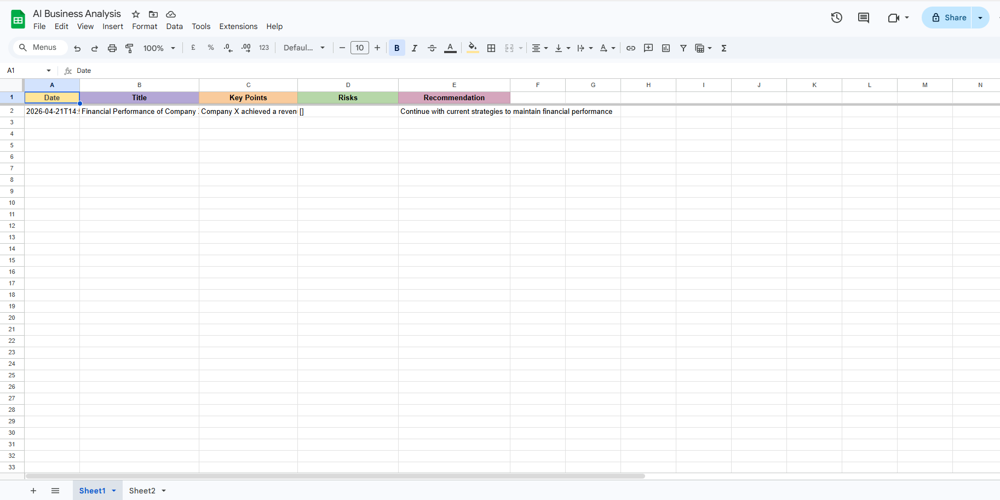

# Business Intelligence Agent
### Automated PDF Summarization using LangChain + Mistral AI + N8N

## What it does
Drops a business PDF in → AI reads and summarizes it → 
structured JSON output → automatically sent to Google Sheets via N8N.

## Architecture
PDF → LangChain → Mistral AI (local) → JSON → N8N → Google Sheets

## Tech Stack
- Python, LangChain, Mistral AI (via Ollama)
- N8N for workflow automation
- Google Sheets integration
- DSGVO compliant — all data processed locally

## How to run
1. Install dependencies:
   pip install langchain langchain-community langchain-ollama
   langchain-core langchain-text-splitters pypdf
   python-dotenv requests
2. Install and start Ollama: ollama pull mistral
3. Start N8N: n8n start
4. Run: python main.py sample_reports/your_report.pdf

## Demo

